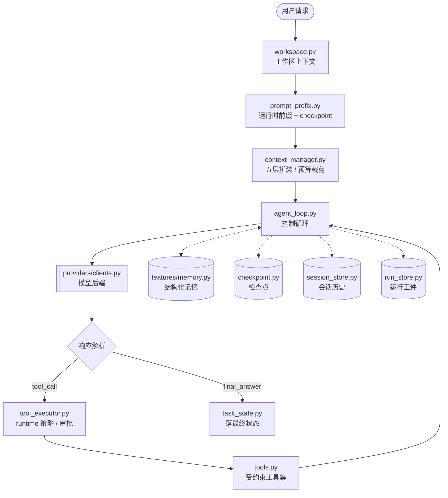
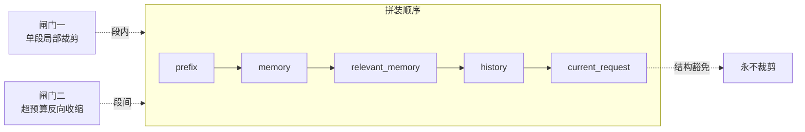

# pico

`pico` 是一个面向代码仓库的轻量本地 coding agent。它直接跑在终端里，先看当前工作区，再用一组受约束的工具去读文件、改文件、跑命令，并把会话状态保存在本地 `.pico/` 目录里。

它更像一个能在仓库里持续工作的命令行助手，不是纯聊天窗口。你可以拿它做代码排查、测试修复、仓库分析，或者让它在当前项目里执行一次性的工程任务。

## 它解决什么问题

拿通用 coding agent 跑多轮仓库任务时，下面几件事会反复出现：

- **prompt 膨胀** —— 每轮把完整历史塞回去，越跑越贵，最后撞上上下文上限
- **重复读文件** —— 同一个文件在多轮里被反复读，token 花在重复劳动上
- **状态丢失** —— 会话中断或上下文被压缩后，agent 忘了任务目标，从头再来
- **工具副作用不可控** —— 改文件、跑命令缺少审批与边界约束
- **结果难复盘** —— 跑完之后没有可审计的工件，说不清哪一步做了什么

`pico` 把这几件事当成**设计对象**来做，而不是指望模型"自己注意"。

## 适合做什么

- 在本地仓库里排查测试失败
- 读取当前代码结构并给出修改建议
- 基于现有文件做小步迭代，而不是脱离仓库空想
- 在会话中保留上下文，支持继续上一次工作

## 主要特性

- **分层上下文与预算裁剪** —— prompt 按五层拼装，每层有独立预算与底线；超预算时按固定牺牲顺序逐段收缩，当前请求结构性豁免
- **结构化记忆** —— 工作记忆只给"目录和计数"不给正文；相关笔记按需召回（最多 3 条），避免笔记全量展开炸预算
- **检查点与恢复** —— 任务目标、阻塞点、下一步写入 checkpoint，支持断点续跑，工作区漂移会被检出
- **约束式工具执行** —— `--approval ask|auto|never` 三档审批，shell 执行与文件写入等高风险操作受 runtime 策略控制
- **可审计运行工件** —— 每次运行落 `task_state.json` / `trace.jsonl` / `report.json`
- **评测闭环** —— `pico/evaluation/` 内置 benchmark 与 metrics，支持 harness regression 与 ablation 对比

## 项目结构

- 包名是 `pico`，CLI 命令是 `pico`，模块入口是 `python -m pico`
- 会话保存在 `.pico/sessions/`
- 每次运行的工件保存在 `.pico/runs/<run_id>/`
- 支持四类模型后端：DeepSeek（默认）、OpenAI 兼容 Responses API、Anthropic 兼容 Messages API、Ollama

## 架构概览



### 长上下文治理是核心

`pico` 最花心思的地方在 `context_manager.py`（509 行）。一轮 prompt 的总预算是 `DEFAULT_TOTAL_BUDGET = 12000`，由五层拼成，每层另有独立预算（实际底线为 `max(20, 预算 // 4)`）：

| 层 | 内容 | 预算 | 超预算时的牺牲顺序 |
| --- | --- | --- | --- |
| `prefix` | 工作手册 + 工具说明 + 仓库现状 + checkpoint | 3600 | 最后 |
| `memory` | 工作记忆仪表盘（只给目录和计数，正文不展开） | 1600 | 第三 |
| `relevant_memory` | 按需召回的相关笔记，最多 3 条 | 1200 | **最先** |
| `history` | Transcript 事件流，最近 6 条保真，更旧的降级为摘要 | 5200 | 第二 |
| `current_request` | 本轮用户请求 | 无 | **永不裁剪** |

拆成两层闸门，解决两件不同的事：

- **闸门一**（每段渲染时）—— 段内局部裁剪，防止**单段自己**失控：一条长笔记、一段长历史把整段吃光
- **闸门二**（拼完总长超预算时）—— 段间反向收缩，防止**加总**失控，按牺牲顺序逐段往回砍

当前请求两层都不参与，它是唯一被结构上豁免的段。



## 运行流程与状态工件

一次运行的控制循环（详见 [agent-harness-v1-overview](docs/architecture/agent-harness-v1-overview.md)）：

1. 构建工作区上下文与运行时前缀
2. 把用户请求记入 session history
3. 为本次运行创建 task state
4. 构建有界 prompt 上下文
5. 请求模型响应
6. 把响应解析成 tool call / retry notice / final answer
7. 按 runtime 策略执行工具
8. 写出 task state、trace 事件、checkpoint 与 report 工件

运行结束后，`.pico/runs/<run_id>/` 下产出三个工件：

| 工件 | 内容 |
| --- | --- |
| `task_state.json` | attempts、tool steps、status、stop reason、最终回答 |
| `trace.jsonl` | prompt / model / tool / checkpoint / finish 各阶段的事件时间线 |
| `report.json` | review 摘要、prompt metadata、durable memory 变更、执行 metadata |

## 使用截图

CLI 帮助信息：


启动界面：


REPL 内置命令与会话路径：


## 安装

需要 Python 3.10+。

如果你用 `uv`，直接安装依赖：

```bash
uv sync
```

如果你已经在自己的 Python 环境里工作，也可以直接装成可编辑模式：

```bash
pip install -e .
```

## 快速开始

在当前仓库里启动交互模式。默认 provider 是 DeepSeek：

```bash
uv run pico
```

指定另一个工作目录：

```bash
uv run pico --cwd /path/to/repo
```

直接跑一次性任务：

```bash
uv run pico "inspect the test failures and propose a fix"
```

如果当前环境已经安装过包，也可以直接这样启动：

```bash
python -m pico
```

## 模型后端

默认 provider 是 DeepSeek。第一次配置：

```bash
cp .env.example .env
```

然后在 `.env` 里填 `PICO_DEEPSEEK_API_KEY`（默认接口 `https://api.deepseek.com/anthropic`，默认模型 `deepseek-v4-pro`）即可启动：

```bash
uv run pico
```

配置优先级：

```text
显式 CLI 参数 > .env 里的 PICO_* 变量 > 旧环境变量 > 代码默认值
--provider > PICO_PROVIDER > 代码默认 deepseek
```

除 DeepSeek 外，还支持 OpenAI 兼容 `/responses`、Anthropic 兼容 `/messages`，以及本地 Ollama。

完整的 provider 配置说明（环境变量总表、key 回退链、right.codes、脱敏配置）见 [`docs/providers.md`](docs/providers.md)。

## 常用交互命令

- `/help`：查看内置命令
- `/memory`：查看提炼后的工作记忆
- `/session`：查看当前会话文件路径
- `/reset`：清空当前会话状态
- `/exit` 或 `/quit`：退出 REPL

## 安全与持久化

`pico` 不会默认把所有动作都放开。像 shell 执行、文件写入这类高风险操作，会受审批模式控制：

- `--approval ask`
- `--approval auto`
- `--approval never`

每次运行结束后，都会在 `.pico/runs/<run_id>/` 下写出这些文件：

- `task_state.json`
- `trace.jsonl`
- `report.json`

这些内容默认只保存在本地，不需要跟仓库一起提交。

## 深入阅读

架构文档在 [`docs/architecture/`](docs/architecture/)，每篇都对应到具体源码位置：

| 文档 | 主题 |
| --- | --- |
| [agent-harness-v1-overview](docs/architecture/agent-harness-v1-overview.md) | runtime 形态与运行流程总览 |
| [context-layered-budget-trimming](docs/architecture/context-layered-budget-trimming.md) | 分层上下文与预算裁剪（核心机制） |
| [context-manager-core-reading](docs/architecture/context-manager-core-reading.md) | `context_manager.py` 精读 |
| [checkpoint-core-reading](docs/architecture/checkpoint-core-reading.md) | 检查点与恢复 |
| [session-store-core-reading](docs/architecture/session-store-core-reading.md) | 会话持久化 |
| [memory-core-reading](docs/architecture/memory-core-reading.md) | 结构化记忆 |
| [tool-executor-core-reading](docs/architecture/tool-executor-core-reading.md) | 工具执行与策略 |
| [tool-context-core-reading](docs/architecture/tool-context-core-reading.md) | 工具上下文 |
| [tools-core-reading](docs/architecture/tools-core-reading.md) | 工具集 |
| [tools-implementation-and-wiring](docs/architecture/tools-implementation-and-wiring.md) | 工具的装配与接线 |
| [workspace-core-reading](docs/architecture/workspace-core-reading.md) | 工作区上下文 |
| [evaluation-core-reading](docs/architecture/evaluation-core-reading.md) | 评测闭环 |
| [evaluation-code-walkthrough](docs/architecture/evaluation-code-walkthrough.md) | 评测代码走读 |

评测数据在 [`benchmarks/results/main-resume-repro-2026-06-07/`](benchmarks/results/main-resume-repro-2026-06-07/pico-benchmark-core-report.md)，覆盖 harness regression、context ablation、working memory ablation、recovery ablation 四层；数据来源与口径边界见同目录的 [`DATA_PROVENANCE.md`](benchmarks/results/main-resume-repro-2026-06-07/DATA_PROVENANCE.md)。

想直接读代码的话，[`examples/mini-pico/`](examples/mini-pico/) 是一个可运行的最小实现，把 agent loop、context manager、tool executor、workspace 都缩到单文件能读完的规模。

## 开发

常用本地检查：

```bash
uv run pytest tests -q
uv run ruff check pico tests scripts
```

内部代码现在按较轻的边界拆分：`pico/evaluation/` 放 benchmark 和 metrics，`pico/providers/` 放模型 provider client，`pico/features/` 放可选运行时能力。新代码应直接使用这些包路径；旧的 `pico.evaluator`、`pico.metrics`、`pico.models` 和 `pico.memory` import 不再作为公共入口保留。
